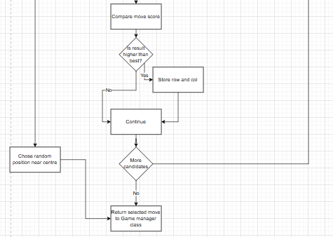

Min-Max Algorithm Python OOP
----

#There may be indentation issues from copying from Visual studio

----

This program selects a strong position for a computer player to chose at every state in a game of Pente
This code demonstrates:
- Inheritance
- Object initialisation
- Encapsulation
- Abstraction + Method decomposition
- Composition
- Recursion
- Tuple unpacking
- Deepcopy
- Boolean Logic
- Alpha-beta pruning (in recursion)
- Heristic evaluation
  

Flowchart -

